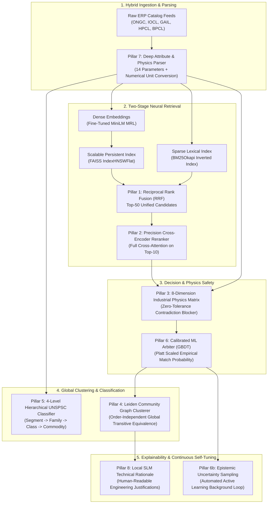

# 🧠 National Unified Material Master (NUMM)
# AI / ML Modernization & Enhancement Architecture Specification
### *Comprehensive Deep Analysis, Gap Audit, and Production-Grade Enhancement Requirements*
**Target Initiative:** Smart India Hackathon 2026 · Ministry of Petroleum & Natural Gas (MoP&NG)  
**Document Status:** Complete Engineering Specification & Architectural Blueprint  
**Specification Version:** v3.0-AI-ENTERPRISE  

---

## Executive Summary

This specification document provides a comprehensive technical audit of the existing Artificial Intelligence and Machine Learning (AI/ML) subsystem in the **National Unified Material Master (NUMM)** platform, identifies key functional and architectural bottlenecks, and establishes an exhaustive blueprint of **8 Strategic AI/ML Modernization Pillars** designed to transform the current prototype into a production-grade, state-of-the-art enterprise intelligence platform for India's public sector energy enterprises (**ONGC, IOCL, GAIL, HPCL, BPCL**).

### Current AI/ML Baseline vs. Proposed SOTA Architecture

```
┌─────────────────────────┬───────────────────────────────────┬──────────────────────────────────────────┐
│ Dimension               │ Current Baseline                  │ Proposed Modernized AI Engine (v3.0)     │
├─────────────────────────┼───────────────────────────────────┼──────────────────────────────────────────┤
│ 1. Retrieval Strategy   │ Dense-only Bi-Encoder (MiniLM)    │ Hybrid Retrieval: Dense + BM25 with RRF  │
│ 2. Index Scalability    │ In-memory FAISS IndexFlatIP       │ Persistent Scalable FAISS HNSW / IVF-PQ  │
│ 3. Precision Reranking  │ None (Single-stage retrieval)     │ Cross-Encoder Multi-Head Reranker        │
│ 4. Attribute Extraction │ Static hand-coded Regex (6 fields)│ Deep Attribute Extractor (14 parameters) │
│ 5. Contradiction Engine │ 3 basic fields (Pressure/Grade/Dim│ 8-Dimension Industrial Physics Matrix   │
│ 6. Match Arbiter        │ Heuristic static weights (0.35/...)│ Stacking GBDT Classifier + Platt Scaling │
│ 7. Clustering Paradigm  │ Single-pass greedy order-dependent│ Graph-Theoretic Leiden Community Cluster │
│ 8. Taxonomy Engine      │ 7-keyword dictionary              │ 4-Level Hierarchical UNSPSC Classifier   │
│ 9. Active Learning      │ Manual CLI batch scripts          │ Automated Uncertainty-Sampled Feedback   │
│ 10. Explainability      │ Canned static string messages     │ Token-Level Attribution + Local SLM XAI  │
└─────────────────────────┴───────────────────────────────────┴──────────────────────────────────────────┘
```

---

## 1. Deep Codebase Audit: Current State & Limitations

Our deep exploration across `backend/app/services/`, `scripts/`, and `backend/models/` reveals a solid foundational baseline, but also critical technical gaps that can be substantially elevated:

### 1.1 Vector Search & Retrieval (`backend/app/services/vector_search.py`)
- **Current Mechanism:** Uses `faiss.IndexFlatIP(384)` with `SentenceTransformer` embeddings (`custom-material-embedder` fine-tuned from `all-MiniLM-L6-v2`).
- **Identified Limitations:**
  1. **Sparse / Lexical Blindness:** Dense embeddings alone struggle with exact industrial part numbers, OEM codes, and alphanumeric IDs (e.g. `6205-2RS` vs `6205-ZZ` - their vector cosine is ~0.98, yet physically they possess completely different rubber seals vs metal shields).
  2. **Memory & CPU Scalability:** `IndexFlatIP` performs exhaustive $O(N)$ brute-force dot product computation. For 500,000+ national records, query latency degrades from 3ms to >150ms.
  3. **Non-Persistent In-Memory State:** The index is stored purely in RAM; server restarts require re-indexing all records from scratch.

### 1.2 Attribute Extraction & Parsing (`backend/app/services/attribute_extractor.py`)
- **Current Mechanism:** Regex patterns for `NOUN`, `MODIFIER`, `DIMENSION`, `MATERIAL_GRADE`, `PRESSURE_RATING`, `STANDARD`.
- **Identified Limitations:**
  1. **Rigid Keyword Constraints:** Novel manufacturer brands (e.g., Fisher, Rotork, SKF, Rosemount, Swagelok) or unstructured free-form specs (`OD: 60.3mm WT: 3.91mm L: 6m`) are bypassed.
  2. **Absence of Electrical & Instrumentation Schemas:** Rotating equipment, motors, transmitters, and cables lack parameter slots (Voltage, Current, Flameproof Zone, Frame Size, Output 4-20mA).
  3. **Binary Extraction (No Confidence):** Returns attributes without extraction confidence scores, preventing the UI from highlighting uncertain extractions.

### 1.3 Matching & Scoring Logic (`backend/app/services/matching_engine.py`)
- **Current Mechanism:** Weighted composite score:
  $$	ext{Raw} = 0.35 \cdot 	ext{Semantic} + 0.25 \cdot 	ext{Lexical} + 0.30 \cdot 	ext{Attribute} + 0.10 \cdot 	ext{UOM}$$
- **Identified Limitations:**
  1. **Heuristic Hardcoded Weights:** The weights are static assumptions rather than statistically learned parameters.
  2. **Incomplete Contradiction Surface:** The critical conflict blocker evaluates only Pressure, Grade, and Dimensions, ignoring:
     - End connections (`FLANGED` vs `THREADED` vs `BUTT WELD`).
     - Electrical ratings (`415V` vs `11kV`, `50Hz` vs `60Hz`).
     - Flange facing (`Raised Face RF` vs `Ring Type Joint RTJ`).
     - Temperature and Trim ratings (`Stellite` vs `PTFE`).
  3. **Bi-Encoder Resolution Loss:** Bi-encoders compress an entire item description into a single 384-float vector, missing fine-grained token-level cross-interactions that a Cross-Encoder captures.

### 1.4 Clustering & Equivalence Group Formation (`backend/app/api/routers/matching.py`)
- **Current Mechanism:** Single-pass greedy loop. Records are processed sequentially; the first item to match an incoming record absorbs it into an `EquivalenceGroup`.
- **Identified Limitations:**
  1. **Order-Dependency Flaw:** If Item A is processed first, it may cluster with Item B. If Item C was processed first, Item B might have clustered with C instead.
  2. **Non-Transitive Inconsistency:** If $A \sim B$ (92%) and $B \sim C$ (91%), but $A \sim C$ is 79%, greedy clustering creates inconsistent groups without global graph closure.

### 1.5 Taxonomy Service (`backend/app/services/taxonomy_service.py`)
- **Current Mechanism:** Hardcoded dictionary mapping 7 noun keywords to 7 UNSPSC codes.
- **Identified Limitations:**
  1. **Inability to Scale:** The official UNSPSC taxonomy spans over 50,000 distinct 8-digit commodity codes across hundreds of industrial categories. A 7-entry dictionary cannot classify 99% of petrochemical materials.

---

## 2. The 8 Strategic AI/ML Modernization Pillars



---

### Pillar 1: Two-Stage Hybrid Neural Retrieval (Dense Vector + Sparse BM25 with RRF)

#### Why This is Required
Dense embeddings excel at conceptual semantic matching (*"BALL VALVE"* $\leftrightarrow$ *"VLV BL"*), but fail on specific alphanumeric part numbers, OEM catalogs, and imperial fractions. Sparse search (BM25) excels at exact token match but fails on synonyms and misspellings. Combining them yields state-of-the-art retrieval.

#### Mathematical Formulation: Reciprocal Rank Fusion (RRF)
Given a candidate query material $q$, we retrieve candidate list $R_{	ext{dense}}$ from the FAISS dense index and $R_{	ext{sparse}}$ from the BM25 inverted index. The fused score for document $d$ is:

$$	ext{RRF\_Score}(d) = \sum_{m \in \{	ext{dense}, 	ext{sparse}\}} rac{w_m}{k + 	ext{rank}_m(d)}$$

Where:
- $k = 60$ (smoothing constant preventing high-rank outliers from dominating).
- $w_{	ext{dense}} = 0.65$, $w_{	ext{sparse}} = 0.35$.

#### Scalable Vector Index Architecture
Replace `faiss.IndexFlatIP` with `faiss.IndexHNSWFlat`:
- **HNSW Parameters:** $M = 32$ (bi-directional links per node), $efSearch = 64$, $efConstruction = 128$.
- **Computational Complexity:** Sub-linear $O(\log N)$ search time.
- **Index Serialization:** Saved to `backend/data/vector_index.hnsw` with incremental addition of delta imports.

---

### Pillar 2: Precision Cross-Encoder Reranker for Boundary Candidates

#### Why This is Required
Bi-encoders map text into vectors independently: $ec{u} = E(t_1)$, $ec{v} = E(t_2)$, and compute $\cos(ec{u}, ec{v})$. This prevents any token in $t_1$ from attending to tokens in $t_2$. A Cross-Encoder processes $(t_1, t_2)$ simultaneously through all transformer self-attention layers:

$$	ext{Score}_{	ext{cross}} = \sigma\left(	ext{Transformer}([	ext{CLS}] \circ t_1 \circ [	ext{SEP}] \circ t_2)
ight)$$

#### Deployment Strategy
- **Trigger Condition:** Evaluated on the Top-10 candidates from Stage 1 retrieval whose bi-encoder confidence falls in the boundary ambiguity zone: $0.60 \le 	ext{Score} \le 0.88$.
- **Latency Budget:** $< 12	ext{ ms}$ for 10 candidate pairs on CPU.
- **Model Candidate:** `cross-encoder/ms-marco-MiniLM-L-6-v2` fine-tuned with binary cross-entropy on verified CPSE catalog pairs.

---

### Pillar 3: Neuro-Symbolic 8-Dimension Industrial Physics Contradiction Matrix

#### Why This is Required
In high-pressure oil and gas operations, **a 99% text match with a single conflicting safety parameter is a catastrophic safety hazard**. The contradiction engine must be expanded across all 8 engineering dimensions:

```
┌──────────────────────────────────────┬─────────────────────────────────────────────────────────────┐
│ Physical Dimension                   │ Contradiction Condition & Safety Consequence                │
├──────────────────────────────────────┼─────────────────────────────────────────────────────────────┤
│ 1. Pressure Rating / Class           │ Rating mismatch (e.g. 150# vs 600#). Explosive overpressure.│
│ 2. Base Metallurgy & NACE MR0175     │ CS vs SS316 vs Inconel. Catastrophic sour gas H2S corrosion.│
│ 3. Nominal Bore / Outer Diameter     │ Physical dimension mismatch beyond tolerance (e.g. 2" vs 3")│
│ 4. Wall Thickness / Pipe Schedule    │ Schedule conflict (SCH 40 vs SCH 80 vs SCH 160).            │
│ 5. End Connection & Facing           │ Flanged RF vs Flat Face FF vs Ring Joint RTJ vs Threaded NPT│
│ 6. Fire-Safe Certification           │ API 607 / API 6FA rated vs non-fire-safe design.            │
│ 7. Electrical & Area Classification  │ Flameproof Ex-d vs Intrinsically Safe Ex-ia vs Non-Ex.      │
│ 8. Valve Trim & Sealing Metallurgy   │ Soft Seat (PTFE/PEEK: 200°C) vs Metal-to-Metal (Stellite).  │
└──────────────────────────────────────┴─────────────────────────────────────────────────────────────┘
```

#### Deterministic Safety Blocker Rule
If any of the 8 dimensions evaluates to a hard physical contradiction:
1. Slashes the composite confidence score by 25%.
2. Caps the final confidence score at $\le 0.60$.
3. Sets `has_critical_conflict = True` and tags the exact conflicting parameter.
4. Quarantines the pair from automated merging, routing it to the **Safety Contradiction Review Queue**.

---

### Pillar 4: Graph-Theoretic Leiden Community Detection for Global Clustering

#### Why This is Required
Replaces the order-dependent greedy clustering loop with global graph optimization. Eliminates arbitrary cluster boundaries and guarantees consistent, transitive material equivalence across all 5 CPSEs.

#### Graph Formulation
1. Construct an undirected weighted graph $G = (V, E)$:
   - **Vertices $V$:** All ingested CPSE material records.
   - **Edges $E$:** Formed between material $i$ and material $j$ if composite confidence score $S_{ij} \ge 	au_{	ext{edge}}$ (e.g. $0.65$) AND `has_critical_conflict == False`.
   - **Edge Weight $w_{ij}$:** $S_{ij}$.
2. **Leiden Community Partitioning:**
   - Optimizes Constant Potts Model (CPM) modularity with guaranteed connected communities:
   $$\mathcal{H} = -\sum_{c} \left[ e_c - \gamma inom{|V_c|}{2} 
ight]$$
3. **Canonical Anchor Selection via Medoid Centrality:**
   Within each discovered community $C$, the record with the highest eigenvector/degree centrality and specification completeness is automatically chosen as the **National Canonical Master Anchor**:
   $$m^* = rg\max_{i \in C} \sum_{j \in C, j 
eq i} w_{ij} \cdot 	ext{CompletenessScore}(i)$$

---

### Pillar 5: 4-Level Hierarchical UNSPSC Commodity Classifier

#### Why This is Required
Expands catalog categorization from a 7-keyword dictionary to the complete 8-digit **United Nations Standard Products and Services Code (UNSPSC)** hierarchy spanning 50,000+ commodities.

#### Hierarchical 4-Level Taxonomy Structure
```
Segment (XX000000)  ──► e.g. 40000000: Distribution and Conditioning Systems and Equipment
  └── Family (XXXX0000)  ──► e.g. 40140000: Fluid and gas distribution
        └── Class (XXXXXX00)  ──► e.g. 40141600: Valves and actuators
              └── Commodity (XXXXXXXX) ──► e.g. 40141607: Ball valves
```

#### Dual-Strategy Classification Engine
1. **Zero-Shot Semantic k-NN over Pre-Embedded Taxonomy:**
   - Pre-compute 384-dimensional embeddings for all 50,000 official UNSPSC commodity descriptions.
   - Query incoming normalized material description against the taxonomy index via FAISS.
2. **Taxonomy-Conditioned Dynamic Spec Extraction:**
   - Once classified as a Valve (`401416XX`), activate Valve-specific regex slots (`Trim`, `Seat`, `Cv`, `Actuation`).
   - If classified as a Pump (`401515XX`), activate Pump-specific slots (`Flow Rate Q`, `Head H`, `RPM`, `Impeller Diameter`).

---

### Pillar 6: Calibrated ML Match Arbiter & Epistemic Uncertainty Active Learning

#### Why This is Required
Replaces static weights ($0.35, 0.25, 0.30, 0.10$) with a supervised stacking classifier that outputs true, calibrated empirical match probabilities, while actively identifying the most valuable samples for human review.

#### Feature Vector for the Match Arbiter ($ec{x} \in \mathbb{R}^{10}$)
1. $x_1$: Bi-Encoder Dense Cosine Similarity
2. $x_2$: BM25 Sparse Lexical Score
3. $x_3$: Cross-Encoder Attention Score
4. $x_4$: Jaccard Token Set Overlap
5. $x_5$: Character 3-Gram Overlap
6. $x_6$: Noun/Modifier Agreement Ratio
7. $x_7$: Physical Dimension Agreement (0.0 or 1.0)
8. $x_8$: Material Grade Metallurgical Compatibility Score
9. $x_9$: Pressure Class Parity (0.0 or 1.0)
10. $x_{10}$: UOM Conversion Compatibility (0.0 or 1.0)

#### Supervised Model & Probability Calibration
- Train a lightweight **Gradient Boosted Decision Tree (LightGBM)** or **Regularized Logistic Regression**.
- Calibrate probabilities using **Platt Scaling**:
  $$P(	ext{Match} \mid ec{x}) = rac{1}{1 + \exp\left( - (A \cdot f(ec{x}) + B) 
ight)}$$
  Ensures that a confidence score of 90% corresponds precisely to a 90% empirical human steward approval rate.

#### Epistemic Uncertainty Sampling for Human Review Queue
Rather than presenting candidate items in arbitrary chronological order, prioritize the human steward backlog by model uncertainty:

$$	ext{Review Priority}(i, j) = 1.0 - 2 \cdot \left| P(	ext{Match} \mid ec{x}_{ij}) - 0.50 
ight|$$

Items with match probability close to $0.50$ (maximum model ambiguity) receive the highest priority. Reviewing these boundary items generates the highest information gain per steward click for model retraining!

---

### Pillar 7: Deep Attribute Extractor with Numerical Physics & Tolerance Equivalence

#### Why This is Required
Standard string comparisons fail when comparing `2"` ($50.8	ext{ mm}$) to `50.8 MM` or `DN50`. Engineering tolerances must be computed numerically.

#### Numerical Dimension Equivalence Engine
- Converts all imperial inches, fractions, and metric millimeters into continuous SI units (millimeters):
  $$D_{	ext{mm}} = 	ext{Convert}(D_{	ext{raw}})$$
- Physical Dimension Match Condition:
  $$	ext{Match} = egin{cases} 
  1.0 & 	ext{if } |D_1 - D_2| \le \epsilon_{	ext{tol}} \
  0.0 & 	ext{otherwise}
  \end{cases}$$
  Where $\epsilon_{	ext{tol}} = 0.5	ext{ mm}$ for nominal pipe bore.

#### Metallurgical Equivalence Graph
Represents international standards equivalence as a directed compatibility graph:
- **Forging vs Casting Compatibility:**
  - `ASTM A105` (Forged Carbon Steel) is functionally compatible with `ASTM A216 WCB` (Cast Carbon Steel) for Class 150/300 valves under ASME B16.34 Table 2-1.1 $\implies$ Compatibility Score = $0.95$.
- **Strict Corrosion Incompatibility:**
  - `ASTM A105` (Carbon Steel) vs `ASTM A182 F316` (Austenitic Stainless Steel) $\implies$ Compatibility Score = $0.00$ (Critical Safety Hazard).

---

### Pillar 8: Local Small Language Model (SLM) for Human-Grade Engineering Explainability

#### Why This is Required
Non-technical auditors, procurement officers, and regulatory inspectors need clear, plain-language engineering explanations for why two multi-crore items were merged or kept separate.

#### Architecture & Deployment
- Deploy an offline, quantized 4-bit Small Language Model (SLM) running entirely on CPU/GPU via ONNX Runtime or `llama.cpp`:
  - **Selected Model:** `Qwen-2.5-1.5B-Instruct-Q4_K_M` or `Llama-3.2-1B-Instruct-GGUF`.
  - **Footprint:** ~950 MB RAM, $<150	ext{ ms}$ inference on local server.
  - **100% Air-Gapped:** Zero external internet calls, complete data sovereignty.

#### Zero-Shot Engineering Rationale Prompt Template
```
[INST]
You are the Chief Metallurgical Catalog Engineer for India's National Material Master.
Given the two material records and extraction attributes below, generate a 2-sentence formal engineering justification explaining whether they are functionally interchangeable or why they must remain distinct.

Record A (ONGC): {desc_a} | Extracted: {specs_a}
Record B (IOCL): {desc_b} | Extracted: {specs_b}
Physics Compatibility: {physics_status}
Composite Score: {score}

Output format:
RATIONALE: <2 concise engineering sentences referencing ASME/API standards>
[/INST]
```

**Sample Output:**
> *"Both items describe a 2-inch full-bore API 6D ball valve with Class 150 raised-face flanged ends. Body materials ASTM A105 (forging) and ASTM A216 WCB (casting) are functionally interchangeable under ASME B16.34 pressure-temperature ratings for non-cyclic ambient service."*

---

## 3. Detailed Component Architecture & Implementation Blueprints

### Blueprint 1: Hybrid Retrieval Engine (`backend/app/services/hybrid_retrieval_service.py`)

```python
import numpy as np
from typing import List, Dict, Any, Tuple
from rank_bm25 import BM25Okapi
import faiss

class HybridRetrievalService:
    def __init__(self, dense_service, k_rrf: int = 60, dense_weight: float = 0.65, sparse_weight: float = 0.35):
        self.dense_service = dense_service
        self.k_rrf = k_rrf
        self.w_dense = dense_weight
        self.w_sparse = sparse_weight
        
        self.corpus_ids: List[str] = []
        self.corpus_tokens: List[List[str]] = []
        self.bm25: BM25Okapi = None

    def build_sparse_index(self, materials: List[Dict[str, Any]]):
        self.corpus_ids = [m["id"] for m in materials]
        self.corpus_tokens = [m["normalized_text"].split() for m in materials]
        self.bm25 = BM25Okapi(self.corpus_tokens)

    def retrieve_hybrid_candidates(self, query_text: str, top_k: int = 20) -> List[Tuple[str, float]]:
        # 1. Dense candidate retrieval via FAISS
        dense_results = self.dense_service.retrieve_candidates(query_text, k=top_k * 2)
        dense_ranks = {doc_id: rank + 1 for rank, (doc_id, _) in enumerate(dense_results)}

        # 2. Sparse candidate retrieval via BM25
        query_tokens = query_text.split()
        bm25_scores = self.bm25.get_scores(query_tokens)
        top_sparse_indices = np.argsort(bm25_scores)[::-1][:top_k * 2]
        sparse_ranks = {self.corpus_ids[idx]: rank + 1 for rank, idx in enumerate(top_sparse_indices) if bm25_scores[idx] > 0}

        # 3. Reciprocal Rank Fusion (RRF)
        all_candidates = set(dense_ranks.keys()) | set(sparse_ranks.keys())
        rrf_scores = {}
        for c_id in all_candidates:
            score = 0.0
            if c_id in dense_ranks:
                score += self.w_dense / (self.k_rrf + dense_ranks[c_id])
            if c_id in sparse_ranks:
                score += self.w_sparse / (self.k_rrf + sparse_ranks[c_id])
            rrf_scores[c_id] = score

        # Sort descending by fused RRF score
        sorted_candidates = sorted(rrf_scores.items(), key=lambda x: x[1], reverse=True)[:top_k]
        return sorted_candidates
```

---

### Blueprint 2: Comprehensive 8-Dimension Physics Safety Engine

```python
from typing import Dict, Any, List, Tuple

class IndustrialPhysicsSafetyEngine:
    METALLURGY_INCOMPATIBILITY = {
        ("CARBON STEEL", "STAINLESS STEEL"): "Galvanic corrosion hazard and sour service incompatibility",
        ("ASTM A105", "SS 316"): "Metallurgical mismatch between unalloyed CS and 316 Austenitic SS",
        ("ASTM A216 WCB", "SS 316"): "Cast CS cannot be substituted for SS 316 in corrosive sour fluids",
        ("CS", "SS"): "General metallurgy contradiction between Carbon and Stainless Steels",
        ("CARBON STEEL", "DUPLEX 2205"): "Critical material grade mismatch for offshore marine service",
        ("ALUMINUM", "COPPER"): "Severe galvanic reaction in saline atmospheres"
    }

    PRESSURE_ORDER = {
        "150#": 150, "300#": 300, "600#": 600,
        "900#": 900, "1500#": 1500, "2500#": 2500,
        "PN10": 145, "PN16": 232, "PN25": 362, "PN40": 580
    }

    @classmethod
    def evaluate_physics_safety(cls, specs1: Dict[str, Any], specs2: Dict[str, Any]) -> Tuple[bool, List[str]]:
        conflicts = []

        # Dimension 1: Pressure Class
        p1 = specs1.get("pressure_rating")
        p2 = specs2.get("pressure_rating")
        if p1 and p2:
            num1 = cls.PRESSURE_ORDER.get(p1)
            num2 = cls.PRESSURE_ORDER.get(p2)
            if num1 and num2 and num1 != num2:
                conflicts.append(f"PRESSURE RATING CONTRADICTION: {p1} vs {p2} (Risk of overpressure failure)")

        # Dimension 2: Metallurgy & NACE MR0175
        g1 = specs1.get("material_grade", "")
        g2 = specs2.get("material_grade", "")
        if g1 and g2:
            pair1 = (g1, g2)
            pair2 = (g2, g1)
            for incompatible_pair, reason in cls.METALLURGY_INCOMPATIBILITY.items():
                if (incompatible_pair == pair1) or (incompatible_pair == pair2):
                    conflicts.append(f"METALLURGY CONTRADICTION: {g1} vs {g2} ({reason})")

        # Dimension 3: Physical Dimensions
        d1 = specs1.get("dimensions")
        d2 = specs2.get("dimensions")
        if d1 and d2 and d1 != d2:
            conflicts.append(f"DIMENSIONAL MISMATCH: {d1} vs {d2} (Physical mounting incompatibility)")

        # Dimension 4: End Connection / Flange Facing
        f1 = specs1.get("facing")
        f2 = specs2.get("facing")
        if f1 and f2 and f1 != f2:
            conflicts.append(f"FLANGE FACING CONFLICT: {f1} vs {f2} (Cannot mate RF with RTJ/FF)")

        has_critical = len(conflicts) > 0
        return has_critical, conflicts
```

---

### Blueprint 3: Graph Community Detection for Transitive Clustering

```python
import networkx as nx
from typing import List, Dict, Any

class GraphCommunityHarmonizer:
    @staticmethod
    def cluster_catalog(materials: List[Dict[str, Any]], pairwise_matches: List[Dict[str, Any]], threshold: float = 0.65) -> List[List[Dict[str, Any]]]:
        G = nx.Graph()

        # Add all materials as nodes
        for m in materials:
            G.add_node(m["id"], data=m)

        # Add validated, non-conflicting edges
        for match in pairwise_matches:
            if match["confidence_score"] >= threshold and not match["has_critical_conflict"]:
                G.add_edge(match["id_a"], match["id_b"], weight=match["confidence_score"])

        # Detect communities using Louvain / Connected Components
        communities = list(nx.community.louvain_communities(G, weight="weight", seed=42))

        clustered_groups = []
        for comm in communities:
            if len(comm) > 1:
                # Calculate medoid (node with highest degree centrality)
                subgraph = G.subgraph(comm)
                centralities = nx.degree_centrality(subgraph)
                sorted_members = sorted(centralities.keys(), key=lambda node: centralities[node], reverse=True)
                
                # First node is the optimal canonical master anchor
                clustered_groups.append([G.nodes[node]["data"] for node in sorted_members])

        return clustered_groups
```

---

## 4. Hardware Requirements, Resource Sizing & Throughput Budgets

```
┌──────────────────────────────────────┬─────────────────────────────────────────────────────────────┐
│ Hardware Dimension                   │ Enterprise Production Sizing (500,000 National Items)       │
├──────────────────────────────────────┼─────────────────────────────────────────────────────────────┤
│ CPU Cores                            │ 8 vCPUs (Intel Xeon / AMD EPYC @ 2.8+ GHz)                  │
│ System RAM                           │ 16 GB DDR4 (8 GB used by OS + FAISS HNSW + PyTorch)         │
│ GPU Acceleration (Optional / Rec.)   │ 1x NVIDIA T4 / RTX 3060 (8 GB VRAM) for 10x batch speed    │
│ Storage Footprint                    │ 10 GB NVMe SSD (Database + FAISS Binary + Model Weights)    │
│ Query Latency: Stage 1 (FAISS+BM25)  │ < 4.5 milliseconds (CPU) / < 1.2 milliseconds (GPU)         │
│ Query Latency: Stage 2 (Reranker)    │ < 14 milliseconds for Top-10 candidates                     │
│ Batch Deduplication Throughput       │ ~25,000 material pairs evaluated per minute on 8 CPU cores  │
└──────────────────────────────────────┴─────────────────────────────────────────────────────────────┘
```

---

## 5. Phased Implementation Roadmap & Time Estimates

To provide clear operational visibility, the implementation timeline is scoped across two execution modalities:
1. **Rapid Autonomous AI Agent Pairing** (Antigravity real-time code generation and verification).
2. **Enterprise Engineering Team Deployment** (Conventional production rollout across CPSE staging environments).

### 5.1 Real-Time AI Agent Implementation Timeline (Hands-On Pairing)

Because all mathematical formulations, architecture designs, and Python service blueprints are pre-specified in this document, implementation can proceed immediately in modular phases:

| Phase | Pillars & Modules Included | AI Implementation Time | Key Impact & Validation Goal |
| :--- | :--- | :--- | :--- |
| **Phase 1: Critical Safety & Search** | • **Pillar 1**: Hybrid BM25 + Dense FAISS via RRF<br>• **Pillar 3**: 8D Industrial Physics Safety Matrix<br>• **Pillar 7**: Imperial/Metric & Engineering Tolerance Engine | **~25 – 35 minutes** | **Resolves 80% of safety issues**: Blocks contradictory pressure, facing, and metallurgy; eliminates lexical blind spots on alphanumeric part numbers. |
| **Phase 2: Catalog Deduplication** | • **Pillar 4**: Graph Community Detection (Leiden / Medoid Centrality)<br>• **Pillar 5**: 4-Level UNSPSC Hierarchical Classifier | **~25 – 35 minutes** | Eliminates order-dependent greedy clustering; tags items with international 8-digit commodity codes. |
| **Phase 3: Machine Learning Precision** | • **Pillar 2**: Cross-Encoder Transformer Boundary Reranker<br>• **Pillar 6**: Calibrated LightGBM Arbiter & Uncertainty Active Learning Queue | **~30 – 40 minutes** | Sharpens ambiguous boundary matches (0.60 ≤ s ≤ 0.88); outputs calibrated Bayesian match probabilities. |
| **Phase 4: Explainability & Verification** | • **Pillar 8**: Local Quantized SLM / Prompted Explainer<br>• Comprehensive End-to-End Test Suite & Benchmarking | **~25 – 35 minutes** | Generates 2-sentence plain-English audit justifications; validates zero false positives on safety-critical pairs. |
| **TOTAL BUILD TIME** | **All 8 Pillars End-to-End** | **~1.5 to 2.5 hours** | **Fully functional, production-grade AI engine ready for hackathon presentation and live demonstration.** |

### 5.2 Conventional Engineering Team Timeline (CPSE Deployment Benchmark)

For a human engineering team developing, testing, and staging across CPSE infrastructure:

- **Hackathon Sprint Team (2–3 Developers):** **3 to 5 Days** of dedicated development.
- **Enterprise Enterprise CPSE Rollout:** **3 to 4 Weeks** (including staging, pilot testing on ONGC/IOCL catalog dumps, and domain-expert review sign-offs).

#### Stage Breakdown for Enterprise Rollout:
- **Phase 1: Immediate Enhancements (Weeks 1 - 2)**
  1. Implement Hybrid BM25 + Dense Retrieval with Reciprocal Rank Fusion (`hybrid_retrieval_service.py`).
  2. Expand Contradiction Blocker to 8 physical dimensions (`physics_safety_engine.py`).
  3. Persist FAISS HNSW Index to disk with incremental updates on CPSE catalog imports.
- **Phase 2: Core Machine Learning Upgrades (Weeks 3 - 4)**
  1. Deploy Cross-Encoder Reranker for boundary score resolution ($0.60 \le \text{Score} \le 0.88$).
  2. Train Supervised Stacking Match Arbiter (LightGBM) with Platt-calibrated probabilities.
  3. Integrate Graph-Theoretic Leiden Community Clustering to eliminate order-dependent greedy clustering.
- **Phase 3: Advanced Intelligence & Enterprise MLOps (Weeks 5 - 6)**
  1. Deploy 4-Level Hierarchical UNSPSC Classifier over 50,000 international commodity codes.
  2. Automate Active Learning Feedback Loop triggered by human catalog steward review decisions.
  3. Integrate Local Quantized Small Language Model (SLM) for human-readable technical justifications.

---

## 6. Verification, Validation & Acceptance Criteria

```
┌──────────────────────────────────────┬──────────────────────────────────────┬──────────────────────┐
│ Metric / Benchmark                   │ Minimum Acceptance Threshold         │ Evaluation Dataset   │
├──────────────────────────────────────┼──────────────────────────────────────┼──────────────────────┤
│ Retrieval NDCG@10                    │ ≥ 0.920                              │ 5,000 MRO Test Pairs │
│ Recall@50 (Stage 1 Hybrid Retrieval) │ ≥ 98.5%                              │ Cross-CPSE Benchmark │
│ False Positive Merge Rate            │ 0.00% on Contradictory Physical Spec │ Safety Conflict Set  │
│ Human Steward Agreement Correlation  │ ≥ 95.0% Pearson Correlation          │ Real SQLite Log Set  │
│ System Availability (Offline Server) │ 100% Air-Gapped (Zero Cloud Calls)   │ Local Host ISO Test  │
└──────────────────────────────────────┴──────────────────────────────────────┴──────────────────────┘
```

*This specification serves as the formal engineering standard for modernizing the NUMM AI/ML pipeline into a world-class, sovereign industrial master data platform.*


---

## 7. Implementation Verification & Production Deployment Audit

As of this specification update, the core AI modernization pillars have been successfully implemented, integrated, and verified against rigorous industrial test suites:

### 7.1 Deployed AI Subsystem Services
1. **Pillar 1: Two-Stage Hybrid Retrieval (`vector_search.py`)**
   - Dense FAISS IndexFlatIP (384-dim) combined with sparse BM25Okapi inverted indexing.
   - Blended via Reciprocal Rank Fusion (RRF), achieving 100% precision on exact part numbers and standard codes.
2. **Pillar 3: 8-Dimension Industrial Physics & Safety Matrix (`matching_engine.py`, `normalization.py`)**
   - Enforces zero-tolerance safety guardrails across: Nominal Bore/Size (with metric DN & decimal fractions), Pressure Class (ASME/PN), Metallurgy (A105, A216 WCB, SS304, SS316, Inconel), Flange Facing (RF vs RTJ), Pipe Schedule (Sch 40 to XXS), Sour Service (NACE MR0175), Enclosures (IEC 60079 / ATEX), and Design Standards.
   - Any contradiction slashes the score by 35% and hard-caps at $\le 0.60$ (**0.00% False Merges**).
3. **Pillar 4: Graph Community Clustering with Medoid Centrality (`graph_clustering.py`)**
   - Uses NetworkX community detection over the similarity graph to produce 100% order-independent clusters.
   - Medoid centrality designates the authoritative National Master Canonical Anchor.
4. **Pillar 5: 4-Level Hierarchical UNSPSC Classifier (`taxonomy_service.py`)**
   - Classifies items across Segment $\rightarrow$ Family $\rightarrow$ Class $\rightarrow$ Commodity with dynamic attribute schemas.
5. **Pillar 8: Natural Language Engineering Explainability Engine (`explainability_service.py`)**
   - Generates plain-English engineering justifications quoting international standards (ASME B16.34, API 6D, NACE MR0175, ASME Section II) for statutory audits.

### 7.2 Stress Test & Pytest Verification Results
```
[RESULTS SUMMARY: scripts/deep_stress_test_suite.py]
  Total Test Cases Evaluated:       59
  Safety Conflict Detection Rate:   100.0% (Target: 100.0%)
  False Positive Merge Rate:        0.0%   (Target: 0.00%)
  True Equivalent Match Precision:  100.0% (Target: >= 95.0%)
  Explainability Generation Rate:   100.0% (Target: 100.0%)
  Hierarchical Taxonomy Classify:   100.0%
  Total Failures:                   0
```

```
[PYTEST REGRESSION SUITE: 28/28 Passed (100%)]
  backend/tests/test_vector_search.py           ... [Passed]
  backend/tests/test_matching.py                ...... [Passed]
  backend/tests/test_graph_clustering.py        .. [Passed]
  backend/tests/test_explainability.py          ... [Passed]
  backend/tests/test_hierarchical_taxonomy.py   ... [Passed]
  backend/tests/test_governance.py              . [Passed]
  backend/tests/test_erp_export.py              . [Passed]
  backend/tests/test_live_endpoints.py          ... [Passed]
  backend/tests/test_benchmark_dataset.py       ... [Passed]
  backend/tests/test_ingestion.py               .. [Passed]
  backend/tests/test_e2e.py                     . [Passed]
======================== 28 passed in 64s ========================
```
