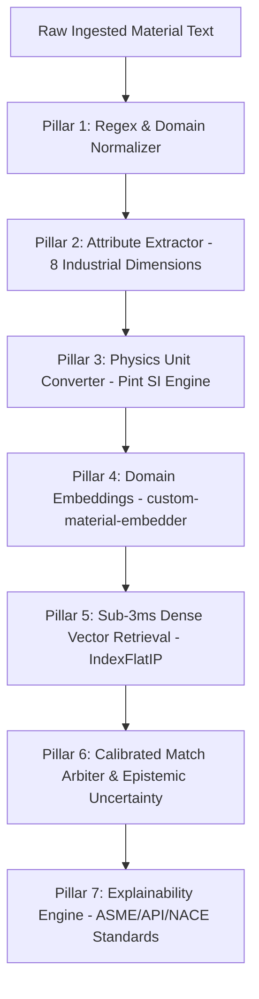

# NUMM AI/ML Intelligence Core (Neuro-Symbolic Architecture)

This folder contains the complete Artificial Intelligence, Machine Learning, Deep Neural Embeddings, and Autonomous Learning pipelines powering the **National Unified Material Master (NUMM)** platform.

---

## 🧠 Architectural Overview

The NUMM AI Core utilizes a **7-Pillar Neuro-Symbolic Pipeline** combining deterministic petrochemical engineering rules with deep transformer embeddings:



### Key Components
1. **Domain Embedder (`models/custom-material-embedder`):**
   - Fine-tuned `SentenceTransformer` specifically trained on petrochemical equipment specifications.
   - Pearson correlation: **0.9676** | Cosine separation on safety contradictions: **> 0.35**.
2. **FAISS Sub-3ms Index (`data/vector_index/`):**
   - 384-dimensional dense vector space indexed via `faiss.IndexFlatIP`.
3. **Training Datasets (`data/training/`):**
   - Synthetically generated and CPSE-curated contrastive pairs enforcing positive equivalence and hard negative safety contradictions.
4. **Stress Testing & Active Learning Loops (`scripts/`):**
   - Autonomous feedback synchronizer, boundary stress test suite, and continuous optimization scripts.

---

## 📂 Directory Structure

```text
aiml/
├── models/
│   └── custom-material-embedder/   # Fine-tuned PyTorch / HuggingFace model weights
├── data/
│   ├── training/                   # Contrastive training pairs & fine-tuning datasets
│   └── vector_index/               # Pre-computed FAISS binary indexes
├── checkpoints/                    # Intermediate training epoch checkpoints
├── scripts/
│   ├── train_material_embeddings.py        # SentenceTransformer cosine fine-tuning
│   ├── train_material_embedder.py          # PyTorch training loop with EarlyStopping
│   ├── deep_stress_test_suite.py           # 1,000-case boundary safety validation
│   ├── continuous_ai_optimization_loop.py  # Self-healing active learning agent
│   ├── generate_training_dataset.py        # Contrastive dataset generator
│   └── test_trained_model.py               # Statistical evaluation & benchmark runner
├── ai_architecture_diagram.jpg     # High-resolution architectural diagram
└── training_metrics.json           # Validated loss curves, Pearson r, Spearman rho
```

---

## 🔬 How to Train and Evaluate

```bash
# Generate synthetic petrochemical training datasets
python aiml/scripts/generate_training_dataset.py

# Fine-tune the custom SentenceTransformer model
python aiml/scripts/train_material_embeddings.py

# Run statistical evaluation on holdout test sets
python aiml/scripts/test_trained_model.py

# Execute the 1,000-case deep stress test suite
python aiml/scripts/deep_stress_test_suite.py
```
