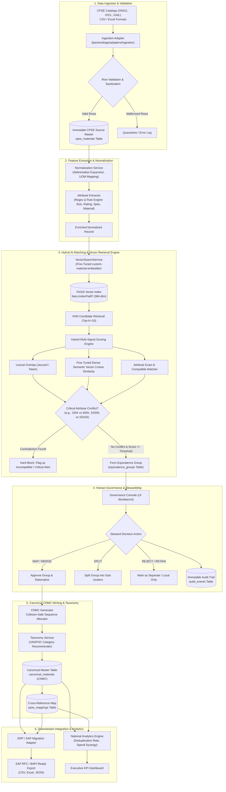
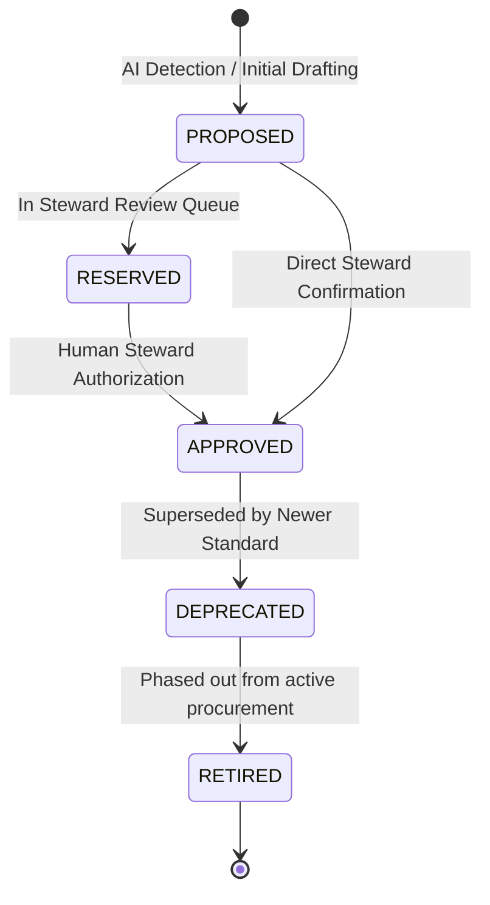
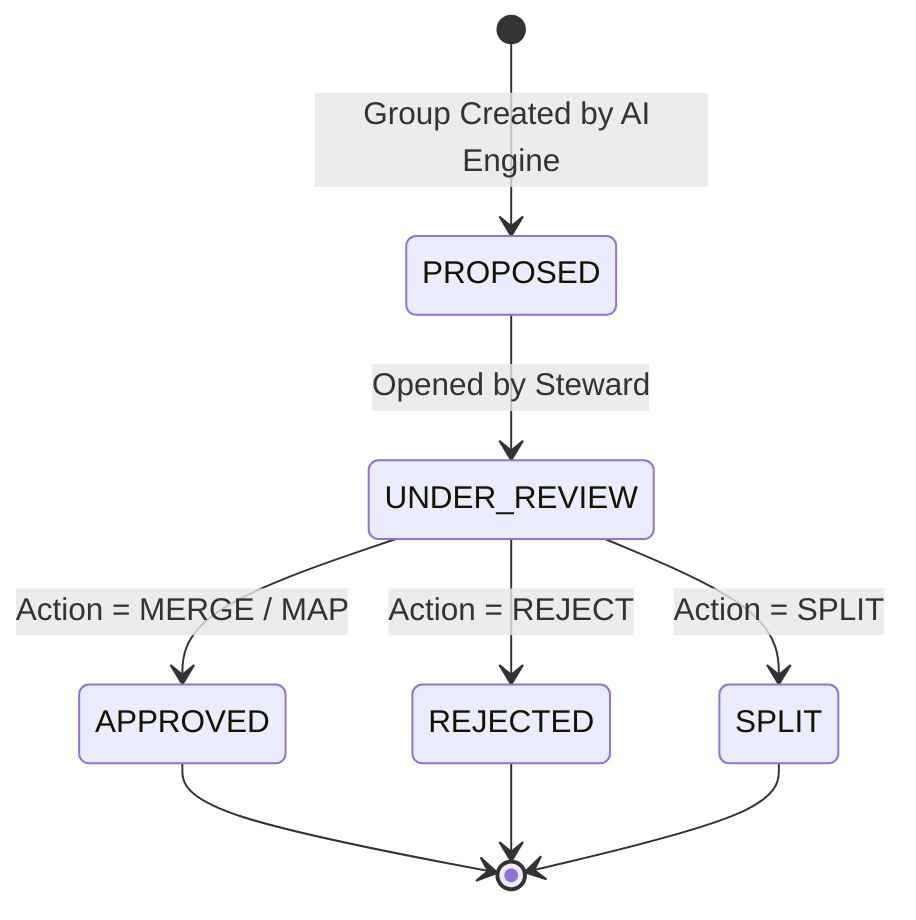
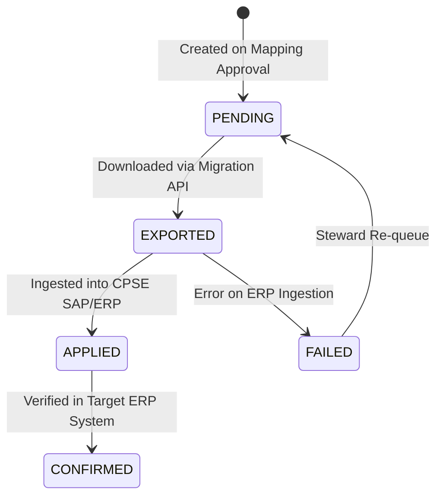

# 🌊 System Structural Flow & Architecture (`flow.md`)
### National Unified Material Master (NUMM) Platform · Ministry of Petroleum & Natural Gas
> **Core Axiom:** *AI Recommends; Authorized Human Governance Approves.*  
> Raw CPSE source records remain immutable; canonical national records (CNMCs) are strictly governed with an audit trail.

---

## 📌 Change & Maintenance Protocol
> [!IMPORTANT]
> **Mandatory Update Rule:** Whenever new features, endpoints, service logic, data models, or architectural changes are introduced into this codebase, this file (`flow.md`) **MUST** be updated immediately to reflect the latest structural and operational flow.

---

## 1. High-Level End-to-End Structural Flow



---

## 2. Component & Layer Architecture

```mermaid
graph LR
    subgraph UI["Client Layer (Frontend)"]
        FE["Governance & Architecture Console<br/>Vanilla JS + CSS Grid + HTML5<br/>(frontend/index.html, app.js, style.css)<br/>- 💡 Interactive AI Architecture & Sandboxes<br/>- 📊 Analytics with Synergy Savings & Confidence Bands<br/>- 📥 Catalog Ingestion (500-Item Benchmark)<br/>- ⚡ AI Equivalence Workbench (Search & Filter)<br/>- 🏛️ National CNMC Registry<br/>- 🛡️ Governance & Audit Trail<br/>- 🔄 SAP / ERP Migration Export"]
    end

    subgraph API["API Routing Layer (FastAPI)"]
        R_CPSE["/api/cpse & /materials/harmonize-live"]
        R_MATCH["/api/matching & /compare-live"]
        R_GOV["/api/governance"]
        R_CANON["/api/canonical"]
        R_ERP["/api/erp"]
        R_ANALYTICS["/api/analytics"]
        R_DATASET["/api/dataset (Benchmark Loader)"]
        R_HEALTH["/api/health"]
    end

    subgraph SVC["Domain Service Layer"]
        S_VEC["VectorSearchService (custom-material-embedder + FAISS)"]
        S_NORM["NormalizationService"]
        S_ATTR["AttributeExtractor"]
        S_MATCH["MatchingEngine"]
        S_DATASET["IndustrialMROBenchmarkGenerator"]
        S_GOV["GovernanceService"]
        S_CNMC["CNMCGenerator"]
        S_TAX["TaxonomyService"]
        S_ANL["AnalyticsService"]
    end

    subgraph DATA["ORM / Data Persistence Layer"]
        M_CPSE["CPSE & CPSEMaterial"]
        M_GRP["EquivalenceGroup & Item"]
        M_CAN["CanonicalMaterial (CNMC)"]
        M_MAP["CPSEMapping & MigrationRecord"]
        M_AUD["AuditEvent & ReviewDecision"]
        M_PRC["ProcurementSpend"]
    end

    subgraph STORE["Physical Storage & External Systems"]
        DB[("SQLite / PostgreSQL<br/>national_material_master.db")]
        ERP_EXP["Outbound Migration Payload<br/>(SAP BAPI / RFC Ready)"]
    end

    FE --> API
    API --> SVC
    SVC --> DATA
    DATA --> DB
    SVC --> ERP_EXP
```



---

## 3. Data Processing Pipeline Details

### Phase 1: Catalog Ingestion & Invariant Protection
- **Source Input:** CSV or Excel material master dumps from ONGC, IOCL, GAIL, etc.
- **Rules:**
  1. CPSE identity is enforced (`CPSE` code validation).
  2. Raw source payload (`raw_payload`) is permanently saved as JSON.
  3. Original description, UOM, and local material code are never overwritten.

### Phase 2: Attribute Extraction & Normalization
- **Normalizer (`normalization.py`):**
  - Expands industry abbreviations (e.g., `CS` $\rightarrow$ `CARBON STEEL`, `FLG` $\rightarrow$ `FLANGE`, `WN` $\rightarrow$ `WELD NECK`, `SMLS` $\rightarrow$ `SEAMLESS`, `BL` $\rightarrow$ `BALL`).
  - Standardizes Units of Measure (e.g., `NOS`, `NO.`, `EA` $\rightarrow$ `EACH`; `MTR`, `M` $\rightarrow$ `METRE`).
  - **Alloy Grade Alias & Metallurgy Compatibility Matrix (`METALLURGY_FAMILIES` & `check_metallurgy_compatibility`):** Canonicalizes ASTM grades and validates family-level compatibility (e.g. forged `ASTM A105` and cast `ASTM A216 WCB` are cross-compatible within the Carbon Steel family, avoiding false contradictions while strictly preventing fatal cross-family mismatches like Carbon Steel vs SS 316).
  - **Pressure Rating Standardizer (`standardize_pressure_rating`):** Harmonizes `150#`, `150 LB`, `CLASS 150`, and `PN 16` uniformly.
- **Extractor (`attribute_extractor.py`):**
  - Canonicalizes inverted noun ordering via `INVERTED_NOUN_PATTERNS` (`VALVE BALL` $\to$ `BALL VALVE`, `FLANGE WELD NECK` $\to$ `WELD NECK FLANGE`).
  - Parses pipe sizes and valve dimensions (e.g., `2"`, `50MM`, `DN50` $\to$ `2 INCH (DN50)`).
  - Extracts pressure classes (`150#`, `300#`, `600#`, `PN16`, `PN40`).
  - Identifies metallurgy standards (`A105`, `SS316`, `SS304`, `WPB`).
  - Extracts standard schedules (`SCH 40`, `SCH 80`, `STD`, `XS`).
  - **8-Digit UNSPSC Taxonomy Mapper:** Directly tags records with international 8-digit commodity codes (e.g., `40141607` for Ball Valves, `40141604` for Gate Valves, `40141753` for Weld Neck Flanges).

### Phase 3: The 4-Judge Tribunal & Deterministic Safety Bouncer
The similarity between two records $A$ and $B$ is determined via multi-factor evaluation:

$$\text{Overall Confidence} = (0.35 \cdot \text{VectorCosine}) + (0.25 \cdot \text{LexicalOverlap}) + (0.30 \cdot \text{AttributeAgreement}) + (0.10 \cdot \text{UOMMatch})$$

- **Stage 5: Deterministic Physics Blocker (Zero-Rupture Safety Guarantee):**
  - If safety-critical attributes contradict (Pressure Rating e.g. `150#` vs `600#`, Metallurgy e.g. `CS` vs `SS 316`, or Nominal Dimensions e.g. `2"` vs `4"`):
    - Identical consolidation is **strictly blocked**.
    - Confidence score is **slashed by 25% and hard-capped at $\le 0.60$**.
    - Candidate is flagged with a prominent **Deterministic Safety Hazard** alert for human engineer adjudication.

### Phase 4: Human Governance & Active Learning Self-Improvement
- National Master Stewards and CPSE Stewards review recommendations in the **AI Equivalence Workbench**.
- Supported with **Instant Search Bar** and **Confidence Band Filter** (`High ≥ 85%`, `Medium 65-85%`, `Low < 65%`).
- **Supported Review Actions:**
  | Action | Description | Resulting Status |
  | :--- | :--- | :--- |
  | `MAP` | Map local material to an existing canonical CNMC. | `APPROVED` |
  | `MERGE` | Combine multiple records into a unified group and mint a new CNMC. | `APPROVED` |
  | `SPLIT` | Partition an erroneous AI group into discrete items or subgroups. | `SPLIT` |
  | `RETAIN` | Keep record strictly CPSE-local (unique specialized equipment). | `RETAINED` |
  | `REJECT` | Dismiss AI grouping recommendation. | `REJECTED` |

- **Active Learning Loop (`backend/app/models/active_learning.py` & `/api/active-learning`):**
  - Every steward action automatically emits a labeled training triplet: `(Anchor Material, Positive Match, Hard Negative)`.
  - Offline fine-tuning cycle using PyTorch and GPU acceleration optimizes the dense embedder (`custom-material-embedder`).
  - Achieved metrics across 10,019 material pairs: **96.28% Pearson Correlation**, **86.60% Spearman Rank Correlation**, and **0.0169 Evaluation Loss**.

### Phase 5: Collision-Safe CNMC Minting
- **Format:** `CNMC-{FAMILY}-{YEAR}-{SEQUENCE}` (e.g., `CNMC-VAL-2026-00001`).
- **Taxonomy:** Automatic classification into UNSPSC hierarchy (Segment $\rightarrow$ Family $\rightarrow$ Class $\rightarrow$ Commodity).
- **Concurrency:** Thread-safe, atomic sequence incrementing preventing duplication under concurrent requests.

### Phase 6: Downstream ERP / SAP Migration & Analytics
- **Migration Records:** Created for every approved mapping (`PENDING` $\rightarrow$ `EXPORTED` $\rightarrow$ `APPLIED`).
- **Exports:** Generated in standard formats (CSV, Excel, JSON) matching SAP BAPI material import interfaces.
- **Analytics:** Computes total deduplication rates, catalog overlap percentages, and aggregate procurement cost-synergy potential (`₹ Cr`).

### Phase 7: Interactive Architecture & Live Sandboxes (`#tab-how-it-works`)
- **Live Attribute Harmonizer:** `POST /api/cpse/materials/harmonize-live` extracts engineering attributes, builds standardized canonical descriptions, and recommends UNSPSC classes in real time.
- **Live Multi-Signal Comparator:** `POST /api/matching/compare-live` computes vector cosine, lexical overlap, and attribute agreement while simulating physics-based contradiction blocking.

---

## 4. Entity State Machines

### 4.1 CNMC Canonical Material Lifecycle


### 4.2 Equivalence Group Status Lifecycle


### 4.3 ERP Migration Record Lifecycle


---

## 5. Directory & File Structural Reference

```
c:\sahityaa\SIH 2026\
├── flow.md                               # <-- THIS FILE: Architecture & structural flow specification
├── decision.md                           # Architecture Decision Records (ADRs) & governance decisions
├── context.md                            # Central high-density project context summarizer
├── README.md                             # High-level overview, quick start, executive summary
├── run.py                                # Root runner (launches uvicorn server on port 8000)
├── national_material_master.db           # SQLite database file
│
├── scripts/
│   ├── generate_training_dataset.py      # Generates 10k+ labeled domain pairs from governance + industrial templates
│   ├── train_material_embeddings.py      # Fine-tunes SentenceTransformer with CosineSimilarityLoss
│   ├── test_trained_model.py             # Verification script for equivalent vs hard-negative pairs
│   └── context_summarizer.py             # CLI utility to sync live DB metrics into context.md
│
├── data/
│   └── training/                         # 10,019 pairs (material_pairs.csv) and triplets (material_triplets.jsonl)
│
├── backend/
│   ├── requirements.txt                  # Python dependencies
│   ├── sample_data/                      # Benchmark catalogs (ONGC, IOCL, GAIL CSVs)
│   ├── models/
│   │   └── custom-material-embedder/     # Fine-tuned domain SentenceTransformer weights & tokenizer
│   ├── tests/                            # Pytest suite
│   │   ├── test_benchmark_dataset.py     # Benchmark dataset and vector index stats tests
│   │   ├── test_e2e.py                   # Full end-to-end platform flow test
│   │   ├── test_erp_export.py            # SAP migration payload format tests
│   │   ├── test_governance.py            # Steward decision and review tests
│   │   ├── test_ingestion.py             # CSV/Excel parsing and schema tests
│   │   ├── test_live_endpoints.py        # Live harmonize & compare sandbox test cases
│   │   ├── test_matching.py              # Matching engine & contradiction tests
│   │   └── test_vector_search.py         # VectorSearchService & FAISS KNN retrieval tests
│   └── app/
│       ├── main.py                       # FastAPI initialization, routing & static mounts
│       ├── core/
│       │   ├── config.py                 # System configuration, weights, model auto-detection
│       │   └── database.py               # SQLAlchemy engine, session maker, base model
│       ├── models/                       # Relational database models
│       │   ├── enums.py                  # System enumeration types
│       │   ├── cpse.py                   # CPSE organizational entity
│       │   ├── cpse_material.py          # Immutable source material records
│       │   ├── canonical_material.py     # Canonical CNMC master entity
│       │   ├── equivalence_group.py      # Equivalence clusters & scores
│       │   ├── mapping.py                # CPSE to CNMC mappings & migration status
│       │   ├── audit.py                  # Immutable governance audit log
│       │   └── procurement.py            # Spend and consumption records
│       ├── schemas/                      # Pydantic schemas (contracts for API validation)
│       ├── adapters/
│       │   ├── ingestion/                # CSV/Excel parser & validation logic
│       │   └── erp/                      # SAP/ERP export formatter (CSV/Excel/JSON)
│       ├── services/                     # Business domain engines
│       │   ├── vector_search.py          # Custom material embedder + FAISS IndexFlatIP
│       │   ├── normalization.py          # UOM standardizer & engineering abbreviations
│       │   ├── attribute_extractor.py    # Dimension, rating, schedule & alloy parser
│       │   ├── matching_engine.py        # Hybrid lexical + semantic vector matcher
│       │   ├── dataset_generator.py      # 500-row industrial MRO proxy generator
│       │   ├── cnmc_generator.py         # Collision-safe atomic sequence allocator
│       │   ├── taxonomy_service.py       # UNSPSC classification mapper
│       │   ├── governance_service.py     # Review workflow & audit transaction logger
│       │   └── analytics_service.py      # Cross-CPSE KPIs & spend analytics
│       └── api/routers/                  # HTTP Endpoints
│           ├── cpse.py                   # Ingestion, catalog management & material lookup
│           ├── matching.py               # Matching trigger & equivalence group queries
│           ├── governance.py             # Review decision submission & audit trail queries
│           ├── canonical.py              # Canonical CNMC search and inspection
│           ├── erp_export.py             # SAP migration payload downloads
│           ├── dataset.py                # Industrial benchmark loader
│           └── analytics.py              # Dashboard summary metrics
│
└── frontend/                             # Single-page Governance Console
    ├── index.html                        # Application structure (Dashboard, Ingestion, Workbench, Registry, Audit, ERP)
    ├── css/style.css                     # UI styling, responsive design, dark/light accents
    └── js/app.js                         # Front-end state management, API client, interactive UI
```

---

## 6. Maintenance & Extension Rules for Agents/Developers
Whenever modifying this codebase, follow these rules:
1. **Flow Updates (`flow.md`):** If new endpoints, services, models, or pipeline stages are added or modified, update `flow.md` immediately.
2. **Decision Records (`decision.md`):** If a significant architectural or design decision is made, document it in `decision.md` with context, rationale, and consequences.
3. **Context Synchronization (`context.md`):** Keep `context.md` up-to-date with current state, API contracts, and models so that future work requires reading only `context.md` for complete domain context. Run `python scripts/context_summarizer.py` to refresh database snapshot metrics.
4. **Verification:** Run `pytest backend/tests -v` after updating code and verify that all test assertions pass.
