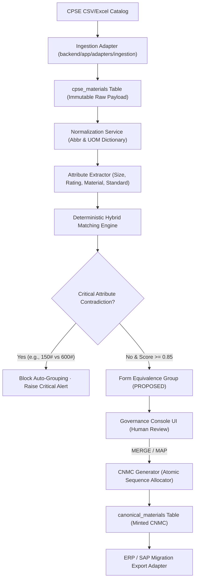
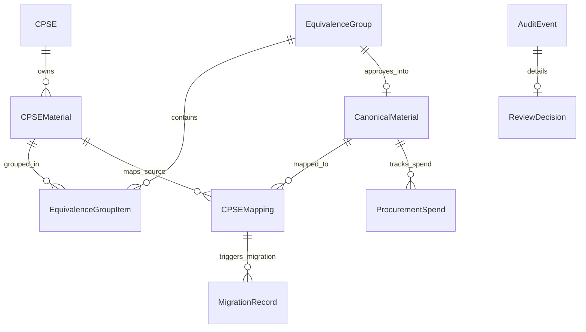

# 🧠 Project Context Summarizer (`context.md`)
### National Unified Material Master (NUMM) Platform · Ministry of Petroleum & Natural Gas (MoPNG)
> **AI/Developer Instruction:** This single document provides complete, high-density domain, architectural, and operational context for this repository. Read this file instead of re-parsing the large SRS/PRD Word documents or scanning the entire codebase.

---

## 1. Executive Summary & Problem Context

| Attribute | Specification |
| :--- | :--- |
| **Problem Statement ID** | **SIH26099** (Smart India Hackathon 2026) |
| **Ministry / Client** | **Ministry of Petroleum & Natural Gas (MoPNG)** |
| **Theme & Category** | Smart Automation · Software |
| **Core National Mandate** | **"One Nation – One Material Code"** across central public sector enterprises (CPSEs) |
| **Enrolled CPSEs** | **ONGC** (Oil & Natural Gas Corp), **IOCL** (Indian Oil Corp Ltd), **GAIL** (Gas Authority of India Ltd) |
| **Primary Problem** | CPSEs procure identical/equivalent items (valves, pipes, flanges, electrical equipment) using fragmented, non-standardized local material codes across legacy SAP/ERP instances. This leads to duplicate inventory, zero procurement synergy, and opaque inter-CPSE stock visibility. |
| **Core Design Axiom** | **"AI Recommends; Authorized Human Governance Approves."** No autonomous destructive code changes. Raw CPSE records remain immutable. |

---

## 2. Stakeholder Roles & Access Boundaries

| Role | Responsibility | Primary Action Permissions |
| :--- | :--- | :--- |
| **National Master Steward** | Ultimate authority over national canonical catalog | `APPROVE`, `MERGE`, `SPLIT`, `REJECT`, Mint CNMC |
| **CPSE Data Steward** | Validates CPSE source catalog & proposes mappings | `MAP`, `EDIT` attributes, `RETAIN`, Ingest batches |
| **ERP / SAP Administrator** | Configures export interfaces and applies migration | `EXPORT` migration files, configure SAP BAPI interfaces |
| **Governance Auditor** | Oversight & vigilance compliance (CVC/CAG ready) | Read-only access to chronological `audit_events` |

---

## 3. Core Architecture & Processing Pipeline

### 3.1 Normalization & Extraction Rules
- **Engineering Abbreviations (`normalization.py`):**
  - `CS` $\rightarrow$ `CARBON STEEL` · `SS` $\rightarrow$ `STAINLESS STEEL`
  - `FLG` $\rightarrow$ `FLANGE` · `WN` $\rightarrow$ `WELD NECK` · `SW` $\rightarrow$ `SOCKET WELD`
  - `NPT` $\rightarrow$ `NATIONAL PIPE TAPER` · `RF` $\rightarrow$ `RAISED FACE`
- **Unit of Measure (UOM) Normalization:**
  - `NOS`, `NO.`, `EA`, `PC`, `PCS` $\rightarrow$ `EACH`
  - `MTR`, `M`, `METER` $\rightarrow$ `METRE` · `KG`, `KGS` $\rightarrow$ `KILOGRAM`
- **Regex Attribute Extraction (`attribute_extractor.py`):**
  - **Sizes:** Inches (`1/2"`, `2"`, `12"`), Millimeters (`DN50`, `50MM`, `100MM`).
  - **Pressure Ratings:** `#` or `LB` (`150#`, `300#`, `600#`, `1500#`), `PN` (`PN16`, `PN40`, `PN100`).
  - **Material Grades:** ASTM/ASME grades (`A105`, `A106`, `A312`, `WPB`, `SS304`, `SS316`, `SS316L`).
  - **Schedules:** `SCH 10`, `SCH 40`, `SCH 80`, `SCH 160`, `SCH STD`, `SCH XS`, `SCH XXS`.

### 3.2 Matching Scoring Formula & Thresholds (`config.py`)
$$\text{Score} = (0.25 \cdot \text{Lexical}) + (0.35 \cdot \text{VectorCosine}) + (0.30 \cdot \text{Attributes}) + (0.10 \cdot \text{UOM})$$

| Threshold Band | Score Range | Default Classification | System Behavior |
| :--- | :--- | :--- | :--- |
| **High** | $\ge 0.85$ | `IDENTICAL` / `DUPLICATE` | Strong CNMC candidate; fast-track review |
| **Medium** | $0.65 - 0.84$ | `NEAR_DUPLICATE` / `FUNCTIONAL` | Mandatory human steward adjudication |
| **Low** | $0.40 - 0.64$ | `RELATED` | Search candidate only; no auto-grouping |
| **Sub-threshold** | $< 0.40$ | Distinct | Kept local / separate |

### 3.3 Custom Fine-Tuned Material Embeddings (`backend/models/custom-material-embedder`)
- **Base Architecture:** `SentenceTransformer` (384-dimensional dense vectors + `faiss.IndexFlatIP`).
- **Domain Fine-Tuning Data:** 10,019 pairs (`data/training/material_pairs.csv` & `material_triplets.jsonl` containing 19 steward-verified governance pairs + 10,000 domain synthetic pairs).
- **Loss Function & Training:** `CosineSimilarityLoss` for 2 epochs, batch size 32.
- **Evaluation Performance:** Pearson Cosine Correlation: **0.9676**, Spearman Correlation: **0.8660**, Final Loss: **0.0787**.
- **Hard-Negative Discrimination:** Pressure rating conflict (`150#` vs `600#`) dropped from generic $>0.85$ down to **0.2292**, eliminating false positive groupings on hazardous specification mismatches.

---

## 4. Entity Relational Models & Schema Summary

### 4.1 Enums & Lifecycles (`backend/app/models/enums.py`)
- **`RelationshipType`:** `IDENTICAL`, `DUPLICATE`, `NEAR_DUPLICATE`, `FUNCTIONALLY_EQUIVALENT`, `RELATED`
- **`CNMCLifecycleStatus`:** `PROPOSED` $\rightarrow$ `RESERVED` $\rightarrow$ `APPROVED` $\rightarrow$ `DEPRECATED` $\rightarrow$ `RETIRED`
- **`GroupStatus`:** `PROPOSED` $\rightarrow$ `UNDER_REVIEW` $\rightarrow$ `APPROVED` / `REJECTED` / `SPLIT`
- **`MappingStatus`:** `PROPOSED` $\rightarrow$ `APPROVED` / `REJECTED`
- **`RationalizationAction`:** `MAP`, `MERGE`, `RETAIN`, `RETIRE`, `REVIEW`, `SPLIT`
- **`MigrationStatus`:** `PENDING` $\rightarrow$ `EXPORTED` $\rightarrow$ `APPLIED` $\rightarrow$ `CONFIRMED` (or `FAILED`)

---

## 5. API Surface Quick Reference

| Router | Method | Endpoint | Description | Key Query / Body |
| :--- | :--- | :--- | :--- | :--- |
| **Health** | `GET` | `/api/health` | Healthcheck & versions | Returns status, rule & model version |
| **CPSE** | `GET` | `/api/cpse` | List registered CPSEs | — |
| **CPSE** | `POST` | `/api/cpse/{code}/imports` | Ingest CSV/Excel catalog | Multipart form: `file` |
| **CPSE** | `GET` | `/api/cpse/{code}/materials` | Get source materials | Query: `limit`, `offset`, `search` |
| **Matching** | `POST` | `/api/matching/run` | Trigger cross-CPSE AI matching | — |
| **Matching** | `GET` | `/api/matching/groups` | Fetch generated equivalence groups | Query: `status`, `min_confidence` |
| **Matching** | `POST` | `/api/matching/compare-live` | Live multi-signal record comparison & conflict check | Body: `{text1, text2, uom1, uom2}` |
| **Matching** | `GET` | `/api/matching/vector-index-status` | FAISS index status & vector count | Returns vector count, dimension, model name |
| **CPSE** | `POST` | `/api/cpse/materials/harmonize-live` | Live attribute extraction & UNSPSC classifier | Body: `{description, uom}` |
| **Dataset** | `POST` | `/api/dataset/benchmark/load-500` | Ingest & index 500-item industrial proxy | Returns rows loaded & indexed |
| **Governance** | `POST` | `/api/governance/equivalence-groups/{id}/review` | Submit human review decision | Body: `{actor, action, reason, target_cnmc}` |
| **Governance** | `GET` | `/api/governance/audit-logs` | Fetch immutable audit trail | Query: `limit`, `action_type` |
| **Canonical** | `GET` | `/api/canonical` | Query approved national CNMCs | Query: `search`, `category`, `status` |
| **ERP Export** | `GET` | `/api/erp/export/migration` | Download SAP migration file | Query: `format=csv\|excel\|json`, `cpse_id` |
| **Analytics** | `GET` | `/api/analytics/national` | Executive KPI dashboard summary | Returns CPSE counts, CNMC totals, synergy spend savings, confidence bands |

---

## 6. Downstream SAP / ERP Integration Contract

### Inbound Canonical Schema (From CPSE ERP)
`CPSE_ID`, `SOURCE_SYSTEM`, `SOURCE_MATERIAL_CODE`, `DESCRIPTION`, `SPECIFICATIONS`, `UOM`, `STATUS`, `EFFECTIVE_DATE`

### Outbound Migration Schema (For SAP BAPI / RFC Ingestion)
`CPSE_ID`, `SOURCE_MATERIAL_CODE`, `CNMC`, `CANONICAL_DESCRIPTION`, `ATTRIBUTES`, `CLASSIFICATION`, `MAPPING_STATUS`, `RATIONALIZATION_ACTION`, `VERSION`, `EFFECTIVE_DATE`

---

## 7. Live System State Snapshot

*(Automatically updated via `python scripts/context_summarizer.py` at 2026-09-05 21:45:23)*

| Metric | Current Value | Notes |
| :--- | :--- | :--- |
| **Database File** | `national_material_master.db` | Local SQLite / SQLAlchemy |
| **Enrolled CPSEs** | **5** | ONGC, IOCL, GAIL, BPCL, HPCL |
| **Source Material Records** | **724** | Source records preserved immutably |
| **Generated Equivalence Groups** | **144** | Cross-catalog clusters identified by AI |
| **Canonical Minted CNMCs** | **10** | Unique national unified codes |
| **Active Approved Mappings** | **21** | CPSE local codes cross-mapped to CNMCs |
| **Pending/Exported Migration Records** | **33** | Ready for SAP BAPI export |
| **Audit Events Logged** | **65** | Full provenance and steward justifications |
| **Active Embedding Model** | `custom-material-embedder` | Fine-tuned SentenceTransformer (Pearson: 0.9676) |
| **Test Suite Status** | **20/20 PASSED across 8 test modules (100%)** | Verified via `pytest backend/tests -v` |

## 8. Directory & File Manifest

| File / Folder | Primary Responsibility |
| :--- | :--- |
| **`flow.md`** | Complete end-to-end structural diagrams, state machines, and pipeline flow |
| **`decision.md`** | Architecture Decision Records (ADRs) and design rationale |
| **`context.md`** | **THIS FILE:** Central high-density project context summarizer |
| **`run.py`** | Zero-config runner (`python run.py` launches backend on `:8000`) |
| **`backend/app/main.py`** | FastAPI app initialization, middleware, routes, frontend static mount |
| **`backend/app/core/config.py`** | Thresholds, weights, database URI, naming patterns, model auto-detection |
| **`backend/app/models/`** | Relational database models (CPSE, Materials, Canonical, Mappings, Audit) |
| **`backend/app/services/`** | Core business logic (Vector Search, Normalization, Attribute Extraction, Matching, CNMC, Governance, Analytics) |
| **`backend/models/custom-material-embedder/`** | Fine-tuned domain SentenceTransformer model weights & tokenizer |
| **`data/training/`** | 10,019 labeled training pairs (`material_pairs.csv`) and triplets (`material_triplets.jsonl`) |
| **`backend/app/adapters/`** | Inbound CSV/Excel parser & Outbound ERP/SAP migration formatter |
| **`backend/sample_data/`** | Real benchmark catalogs for ONGC, IOCL, GAIL |
| **`frontend/`** | Modern responsive Governance Console (HTML5 + CSS + Vanilla JS) |
| **`scripts/`** | Dataset generation, embedding training, evaluation, and context summarizer scripts |
